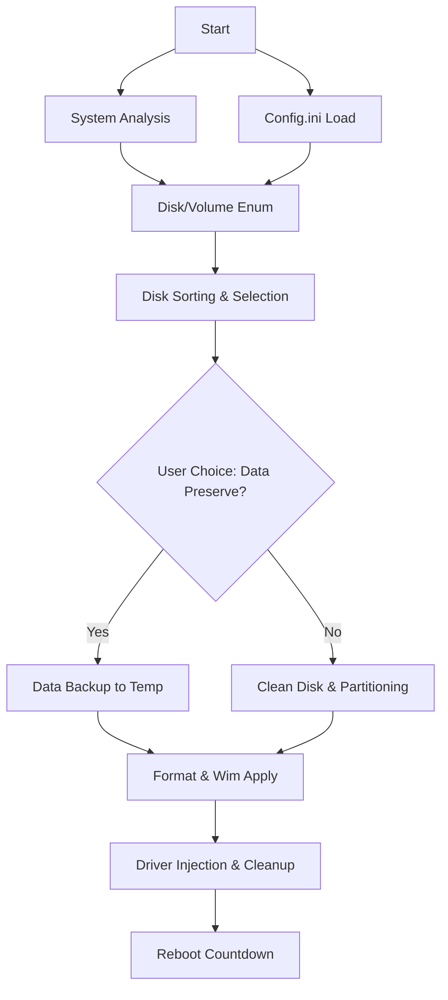

````markdown
# WinSetup 클린 아키텍처 구현 계획서

## 📋 목차

1. [개요](#개요)
2. [아키텍처 원칙](#아키텍처-원칙)
3. [계층 구조](#계층-구조)
4. [폴더 구조](#폴더-구조)
5. [계층별 상세 설계](#계층별-상세-설계)
6. [의존성 규칙](#의존성-규칙)
7. [마이그레이션 계획](#마이그레이션-계획)
8. [구현 가이드](#구현-가이드)
9. [테스트 전략](#테스트-전략)
10. [성능 고려사항](#성능-고려사항)

---

## 개요

### 목표
Windows PE 환경에서 실행되는 설치 프로그램을 클린 아키텍처 원칙에 따라 재구성하여, 테스트 가능하고 유지보수 가능하며 확장 가능한 시스템을 구축합니다.

### 핵심 가치
- **테스트 가능성**: 모든 비즈니스 로직을 외부 의존성 없이 테스트
- **의존성 역전**: 내부 계층이 외부 계층에 의존하지 않음
- **관심사의 분리**: 각 계층은 명확한 책임을 가짐
- **확장성**: 새로운 기능 추가가 용이
- **유지보수성**: 변경의 영향 범위 최소화

### 기술 스택
- **언어**: C++20/23
- **플랫폼**: Windows PE (Windows 10/11)
- **빌드 시스템**: MSVC sln
- **테스트 프레임워크**: Google Test
- **컴파일러**: MSVC 2022 / Clang 15+

---

## 아키텍처 원칙

### 1. 의존성 규칙 (Dependency Rule)

```
외부 계층 → 내부 계층 (❌ 금지)
내부 계층 → 외부 계층 (❌ 금지)
내부 계층 → 추상화 (✅ 허용)
외부 계층 → 추상화 구현 (✅ 허용)
```

**핵심**: 소스 코드 의존성은 항상 내부를 향해야 합니다.

### 2. 추상화 원칙

```cpp
// ❌ 잘못된 예: 구체적 구현에 의존
class MyService {
    Win32FileSystem fileSystem;  // 구체적 클래스
};

// ✅ 올바른 예: 추상화에 의존
class MyService {
    IFileSystem& fileSystem;  // 인터페이스
};
```

### 3. 단일 책임 원칙 (SRP)

각 모듈은 변경의 이유가 단 하나여야 합니다.

```cpp
// ❌ 여러 책임
class UserManager {
    void SaveUser();      // 저장
    void ValidateUser();  // 검증
    void SendEmail();     // 이메일
};

// ✅ 단일 책임
class UserRepository {
    void SaveUser();
};
class UserValidator {
    void ValidateUser();
};
class EmailService {
    void SendEmail();
};
```

### 4. 인터페이스 분리 원칙 (ISP)

클라이언트는 사용하지 않는 메서드에 의존하지 않아야 합니다.

```cpp
// ❌ 거대한 인터페이스
class IMassiveInterface {
    void Method1();
    void Method2();
    // ... 20개의 메서드
};

// ✅ 작은 인터페이스들
class IReader {
    void Read();
};
class IWriter {
    void Write();
};
```

---

## 계층 구조

### 계층 다이어그램

```
┌─────────────────────────────────────────────────────────────┐
│                    Layer 4: Infrastructure                  │
│                  (Frameworks & Drivers)                     │
│  ┌───────────────────────────────────────────────────────┐  │
│  │ Windows API, File System, Registry, Network           │  │
│  │ - 실제 OS 호출                                         │  │
│  │ - UI Framework                                        │  │
│  │ - 외부 라이브러리                                       │  │
│  └───────────────────────────────────────────────────────┘  │
└─────────────────────────────────────────────────────────────┘
                            ▲
                            │ (구현)
┌─────────────────────────────────────────────────────────────┐
│                    Layer 3: Adapters                        │
│                  (Interface Adapters)                       │
│  ┌───────────────────────────────────────────────────────┐  │
│  │ Platform Adapters, Controllers, Presenters            │  │
│  │ - Win32TextEncoder                                    │  │
│  │ - Win32ThreadPool                                     │  │
│  │ - Win32FileSystem                                     │  │
│  │ - Win32WindowHandle                                   │  │
│  └───────────────────────────────────────────────────────┘  │
└─────────────────────────────────────────────────────────────┘
                            ▲
                            │ (의존)
┌─────────────────────────────────────────────────────────────┐
│                    Layer 2: Application                     │
│                  (Use Cases / Business Logic)               │
│  ┌───────────────────────────────────────────────────────┐  │
│  │ Application Services, Use Cases                       │  │
│  │ - EventBus                                            │  │
│  │ - Dispatcher                                          │  │
│  │ - Task / AsyncContext                                 │  │
│  │ - Property (Reactive)                                 │  │
│  └───────────────────────────────────────────────────────┘  │
└─────────────────────────────────────────────────────────────┘
                            ▲
                            │ (의존)
┌─────────────────────────────────────────────────────────────┐
│                    Layer 1: Domain                          │
│                  (Entities / Business Rules)                │
│  ┌───────────────────────────────────────────────────────┐  │
│  │ Domain Entities, Value Objects, Domain Services       │  │
│  │ - Expected / Result                                   │  │
│  │ - Functional (Monads, Optional)                       │  │
│  │ - Memory (SmartPtr, UniqueResource)                   │  │
│  │ - PathValidator (비즈니스 규칙)                         │  │
│  └───────────────────────────────────────────────────────┘  │
└─────────────────────────────────────────────────────────────┘
                            ▲
                            │ (의존)
┌─────────────────────────────────────────────────────────────┐
│                    Layer 0: Abstractions                    │
│                  (Interfaces / Contracts)                   │
│  ┌───────────────────────────────────────────────────────┐  │
│  │ Pure Interfaces - 구현 없음                            │  │
│  │ - ITextEncoder, IFileSystem                           │  │
│  │ - IThreadPool, IWindowHandle                          │  │
│  │ - IEventBus, IDispatcher                              │  │
│  │ - IObservable, IProperty                              │  │
│  └───────────────────────────────────────────────────────┘  │
└─────────────────────────────────────────────────────────────┘
```

### 계층별 역할

#### Layer 0: Abstractions (추상화)
- **역할**: 모든 인터페이스 정의
- **의존성**: Domain 계층만 의존 (타입 정의용)
- **규칙**:
  - 순수 가상 함수만 포함
  - 구현 코드 금지
  - Platform 독립적

#### Layer 1: Domain (도메인)
- **역할**: 핵심 비즈니스 규칙과 엔티티
- **의존성**: 외부 의존성 0 (순수 C++)
- **규칙**:
  - 외부 라이브러리 사용 금지
  - OS API 호출 금지
  - 불변성 보장

#### Layer 2: Application (애플리케이션)
- **역할**: 유즈케이스, 애플리케이션 로직
- **의존성**: Abstractions, Domain
- **규칙**:
  - 인터페이스에만 의존
  - Platform 독립적
  - 비즈니스 플로우 조율

#### Layer 3: Adapters (어댑터)
- **역할**: 외부 세계와 내부 계층 연결
- **의존성**: Abstractions 구현
- **규칙**:
  - 인터페이스 구현
  - Platform 특정 코드 허용
  - Application 계층 알지 못함

#### Layer 4: Infrastructure (인프라)
- **역할**: 프레임워크, 드라이버, UI
- **의존성**: 모든 계층 사용 가능
- **규칙**:
  - Composition Root (main.cpp)
  - 의존성 주입
  - 모든 것을 연결

---

## 폴더 구조

### 전체 구조

```
WinSetup/
│
├── CMakeLists.txt
├── README.md
├── ARCHITECTURE.md
│
├── src/
│   │
│   ├── abstractions/                    # Layer 0: 추상화
│   │   ├── CMakeLists.txt
│   │   │
│   │   ├── platform/
│   │   │   ├── ITextEncoder.h
│   │   │   ├── IPlatformHandle.h
│   │   │   ├── IWindowHandle.h
│   │   │   └── IThreadPool.h
│   │   │
│   │   ├── io/
│   │   │   ├── IFileSystem.h
│   │   │   ├── IStreamReader.h
│   │   │   ├── IStreamWriter.h
│   │   │   └── IPath.h
│   │   │
│   │   ├── async/
│   │   │   ├── IExecutor.h
│   │   │   ├── IScheduler.h
│   │   │   ├── IAwaitable.h
│   │   │   └── IAsyncContext.h
│   │   │
│   │   ├── messaging/
│   │   │   ├── IEventBus.h
│   │   │   ├── IDispatcher.h
│   │   │   └── IMessageQueue.h
│   │   │
│   │   └── reactive/
│   │       ├── IObservable.h
│   │       └── IProperty.h
│   │
│   ├── domain/                          # Layer 1: 도메인
│   │   ├── CMakeLists.txt
│   │   │
│   │   ├── primitives/
│   │   │   ├── Expected.h
│   │   │   ├── Result.h
│   │   │   └── Error.h
│   │   │
│   │   ├── functional/
│   │   │   ├── Monads.h
│   │   │   ├── Optional.h
│   │   │   ├── Pipeline.h
│   │   │   └── Compose.h
│   │   │
│   │   ├── memory/
│   │   │   ├── SmartPtr.h
│   │   │   ├── UniqueResource.h
│   │   │   ├── SharedResource.h
│   │   │   └── PoolAllocator.h
│   │   │
│   │   └── validation/
│   │       ├── PathValidator.h
│   │       ├── PathValidator.cpp
│   │       ├── ValidationRules.h
│   │       └── ValidationResult.h
│   │
│   ├── application/                     # Layer 2: 애플리케이션
│   │   ├── CMakeLists.txt
│   │   │
│   │   ├── async/
│   │   │   ├── Task.h
│   │   │   ├── TaskScheduler.h
│   │   │   ├── TaskScheduler.cpp
│   │   │   ├── AsyncContext.h
│   │   │   ├── AsyncContext.cpp
│   │   │   ├── Awaitable.h
│   │   │   └── Promise.h
│   │   │
│   │   ├── messaging/
│   │   │   ├── EventBus.h
│   │   │   ├── EventBus.cpp
│   │   │   ├── Dispatcher.h
│   │   │   ├── Dispatcher.cpp
│   │   │   └── MessageQueue.h
│   │   │
│   │   ├── reactive/
│   │   │   ├── Property.h
│   │   │   ├── Observable.h
│   │   │   ├── Subject.h
│   │   │   └── Operators.h
│   │   │
│   │   └── events/
│   │       ├── LogEvent.h
│   │       ├── ProgressEvent.h
│   │       ├── ErrorEvent.h
│   │       └── InstallEvent.h
│   │
│   ├── adapters/                        # Layer 3: 어댑터
│   │   ├── CMakeLists.txt
│   │   │
│   │   └── platform/
│   │       └── windows/
│   │           ├── encoding/
│   │           │   ├── Win32TextEncoder.h
│   │           │   └── Win32TextEncoder.cpp
│   │           │
│   │           ├── threading/
│   │           │   ├── Win32ThreadPool.h
│   │           │   ├── Win32ThreadPool.cpp
│   │           │   ├── Win32Thread.h
│   │           │   └── Win32Thread.cpp
│   │           │
│   │           ├── window/
│   │           │   ├── Win32WindowHandle.h
│   │           │   ├── Win32WindowHandle.cpp
│   │           │   ├── Win32Handle.h
│   │           │   └── Win32Handle.cpp
│   │           │
│   │           ├── filesystem/
│   │           │   ├── Win32FileSystem.h
│   │           │   ├── Win32FileSystem.cpp
│   │           │   ├── Win32File.h
│   │           │   └── Win32File.cpp
│   │           │
│   │           └── Win32Factory.h
│   │
│   └── infrastructure/                  # Layer 4: 인프라
│       ├── CMakeLists.txt
│       │
│       ├── composition/
│       │   ├── DependencyContainer.h
│       │   ├── DependencyContainer.cpp
│       │   └── ServiceLocator.h
│       │
│       ├── logging/
│       │   ├── WindowsLogger.h
│       │   └── WindowsLogger.cpp
│       │
│       ├── config/
│       │   ├── ConfigLoader.h
│       │   └── ConfigLoader.cpp
│       │
│       └── diagnostics/
│           ├── PerformanceMonitor.h
│           └── PerformanceMonitor.cpp
│
├── tests/
│   ├── CMakeLists.txt
│   │
│   ├── domain/                          # 도메인 테스트
│   │   ├── ExpectedTests.cpp
│   │   ├── MonadsTests.cpp
│   │   ├── PathValidatorTests.cpp
│   │   └── MemoryTests.cpp
│   │
│   ├── application/                     # 애플리케이션 테스트
│   │   ├── EventBusTests.cpp
│   │   ├── DispatcherTests.cpp
│   │   ├── TaskTests.cpp
│   │   └── PropertyTests.cpp
│   │
│   ├── adapters/                        # 어댑터 테스트
│   │   ├── Win32TextEncoderTests.cpp
│   │   ├── Win32ThreadPoolTests.cpp
│   │   └── Win32FileSystemTests.cpp
│   │
│   ├── integration/                     # 통합 테스트
│   │   ├── EndToEndTests.cpp
│   │   └── PerformanceTests.cpp
│   │
│   └── mocks/                           # Mock 구현
│       ├── MockTextEncoder.h
│       ├── MockWindowHandle.h
│       ├── MockThreadPool.h
│       ├── MockFileSystem.h
│       └── MockEventBus.h
│
├── docs/
│   ├── architecture/
│   │   ├── layers.md
│   │   ├── dependencies.md
│   │   └── patterns.md
│   │
│   ├── guides/
│   │   ├── testing.md
│   │   ├── contributing.md
│   │   └── migration.md
│   │
│   └── api/
│       ├── abstractions.md
│       ├── domain.md
│       └── application.md
│
└── scripts/
    ├── build.ps1
    ├── test.ps1
    └── analyze.ps1
```

# 🚀 WinSetup 고성능 저수준 구현 계획서

## 1. 시스템 아키텍처 개요
본 프로젝트는 **Clean Architecture**를 기반으로 하되, 성능 극대화를 위해 **Asynchronous Task Graph** 모델을 채택합니다.
모든 IO 작업은 비차단(Non-blocking)으로 수행되며, CPU 집약적 작업과 IO 집약적 작업을 분리하여 처리합니다.

---

## 2. 멀티스레딩 및 IO 부하 분산 전략

### 2.1 하이브리드 스레드 풀 (Hybrid Thread Pool)
- **IO Worker Pool**: `IOCP(I/O Completion Ports)` 기반. 디스크 분석, 파일 검색, IOCTL 호출 등 대기 시간이 발생하는 작업 담당.
- **Compute Worker Pool**: SMBIOS 파싱, 정렬 알고리즘, 설정값 검증 등 CPU 연산 담당.
- **Imaging Thread**: `wimlib` 내부의 멀티스레딩 엔진에 위임하되, 전체 시스템 리소스의 80%를 넘지 않도록 코어 제한(Affinity) 관리.

### 2.2 태스크 의존성 그래프 (Task Dependency Graph)


---

## 3. 계층별 저수준 구현 상세

### Layer 0: Abstractions (인터페이스)
최고 성능을 위해 가상 함수 오버헤드를 줄이는 `std::function` 또는 `Concept` 기반의 정적 다형성을 부분 도입합니다.

```cpp
// IDiskService.h
struct DiskInfo {
    uint32_t index;
    STORAGE_BUS_TYPE busType;
    uint64_t size;
    std::wstring path;
};

// 정렬 규칙: 인터페이스(BusType) 우선 -> 용량(Size) 오름차순
auto DiskPriorityComparator = [](const DiskInfo& a, const DiskInfo& b) {
    if (a.busType != b.busType) return a.busType > b.busType;
    return a.size < b.size;
};
```

### Layer 3: Adapters (저수준 API 매핑)

#### A. 시스템 분석 (Hardware & Disk)
- **메인보드 정보**: `GetSystemFirmwareTable` (RSMB) 직접 파싱.
- **디스크 열거**: `SetupDiGetClassDevs` 및 `DeviceIoControl` (`IOCTL_STORAGE_QUERY_PROPERTY`).
- **볼륨 경로 확인**: `GetFileAttributesW`를 사용하여 `\Windows\System32` 등 존재 여부 확인 (병렬 스캔).

#### B. 디스크 관리 (Partitioning & Format)
- **저수준 파티셔닝**: `IOCTL_DISK_SET_DRIVE_LAYOUT_EX`를 사용하여 MBR/GPT 레이아웃을 직접 작성.
- **고속 포맷**: `ifsutil.dll` (Internal Windows API)의 `FormatEx` 호출. `Quick Format` 모드 강제.

#### C. 이미지 적용 (Wimlib)
- **성능 옵션**: `WIMLIB_EXTRACT_FLAG_NO_ACLS` 및 `WIMLIB_EXTRACT_FLAG_SEQUENTIAL` 활성화.
- **비동기 콜백**: `wimlib_progress_func_t`를 통해 추출 상태를 `EventBus`로 송신하여 UI 업데이트와 로직 분리.

---

## 4. 핵심 알고리즘: 디스크 분석 및 자동 선택

이 앱의 핵심인 "스마트 디스크 정렬 및 판별" 로직 구현 계획입니다.

1.  **Parallel Enumeration**: 모든 `PhysicalDrive`를 병렬로 열어 `BusType`과 `Size`를 수집합니다. (USB 제외 필터링)
2.  **Sorting**: 수집된 데이터를 `DiskPriorityComparator`로 정렬하여 1순위(시스템), 2순위(데이터)를 자동 지정합니다.
3.  **Heuristic Scanning**: 각 파티션의 루트를 동시에 탐색하여 `System32` 및 `User Profile` 존재 여부를 점수화(Scoring)합니다.
    - `Windows` + `Users` 존재 시: `IsSystemPartition = true` (점수 100)
    - `Desktop` + `Downloads` 존재 시: `IsDataPartition = true` (점수 80)

---

## 5. 단계별 실행 가이드 (Implementation Roadmap)

### Phase 1: Foundation (1-2주)
- [ ] `Domain/Primitives`: `Result<T>`, `Expected<T>` 구현.
- [ ] `Infrastructure`: IOCP 기반 비동기 익스큐터 및 태스크 시스템 구축.

### Phase 2: Hardware & Disk (2-3주)
- [ ] `Adapter/SMBIOS`: 메인보드 모델명 추출 모듈.
- [ ] `Adapter/Storage`: `IOCTL` 기반 디스크 정보 수집 및 파티셔닝 모듈.
- [ ] `Domain/Scanner`: 파티션 내용 분석 및 시스템/데이터 디렉토리 판별 로직.

### Phase 3: Imaging & Post-Process (3-4주)
- [ ] `Adapter/Wimlib`: `wimlib` 래퍼 및 비동기 진행률 보고 시스템.
- [ ] `Adapter/Dism`: `DismApi`를 이용한 드라이버 주입 모듈.
- [ ] `Application/InstallFlow`: 전체 설치 시나리오(데이터 보존/삭제) 오케스트레이션.

---

## 6. 성능 고려사항 및 제한사항
- **메모리 단편화**: WinPE 환경의 특성상 `wimlib` 추출 시 대용량 버퍼를 미리 할당하여 사용합니다.
- **IO 우선순위**: 백업 데이터 복사(`CopyFileEx`) 시 `IoPriorityHintVeryLow`를 설정하여 이미지 적용 속도에 영향을 주지 않도록 조정 가능합니다.
- **에러 복구**: 모든 `IOCTL` 실패 시 즉시 `Rollback` 대신 `Detailed Error Report`를 생성하여 PE 환경에서 디버깅 가능하게 설계합니다.